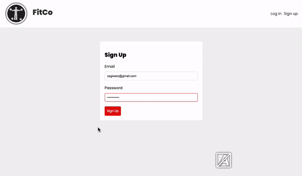

# Workout Tracker App - FitCo

This is a simple workout tracker application built using the MERN (MongoDB, Express.js, React.js, Node.js) stack. It allows users to track their workouts and exercises, set goals, and monitor their progress.



[Working Production of The App](https://fitco-386i.onrender.com/)

 
## Features

- User registration and authentication
- Create, update, and delete workout routines
- Add, edit, and remove exercises within a workout routine
- Track the number of sets, reps, and weight for each exercise
- Set goals for specific exercises or workout routines
- View and analyze workout history and progress
- User-friendly interface with responsive design

## Technologies Used

- MongoDB: A document-oriented NoSQL database used for storing user information, workout routines, and exercise details.
- Express.js: A web application framework for Node.js used to build the backend RESTful API endpoints.
- React.js: A JavaScript library for building user interfaces, used to create the interactive frontend of the application.
- Node.js: A JavaScript runtime environment used to run the server-side code and handle API requests.
- Mongoose: An object data modeling (ODM) library for MongoDB, used to define schemas and interact with the database.
- Axios: A promise-based HTTP client used to make HTTP requests from the frontend to the backend API.
- Bootstrap: A popular CSS framework used for responsive and mobile-first design.
- JWT (JSON Web Tokens): Used for user authentication and authorization.
- Bcrypt: A library used for hashing and salting passwords.

## Installation

Follow the steps below to set up and run the Workout Tracker App on your local machine:

1. Clone the repository:

```
git clone https://github.com/sagiweizmann/Workout-Tracker
```

2. Change to the project directory:
```
cd workout-tracker-app
```
3. Install the dependencies for the server:
```
npm install
```
4. Change to the `frontend` directory:
```
cd frontend
```

5. Install the dependencies for the frontend:
```
npm install
```
6. Go back to the project directory:
```
cd ..
```
7. Rename the `.env.example` file to `.env` and provide the necessary environment variables, such as MongoDB connection URI and JWT secret.

8. Run the application:
```
npm run dev
```

This will start the server and the React development server concurrently.

9. Access the application in your browser at `http://localhost:3000`.

## API Endpoints

The following are the main API endpoints available in the application:

- `POST /api/auth/register` - Register a new user.
- `POST /api/auth/login` - Authenticate and log in a user.
- `GET /api/auth/logout` - Log out the currently authenticated user.
- `GET /api/workouts` - Get all workouts for the authenticated user.
- `POST /api/workouts` - Create a new workout for the authenticated user.
- `GET /api/workouts/:id` - Get a specific workout by ID.
- `PUT /api/workouts/:id` - Update a specific workout by ID.
- `DELETE /api/workouts/:id` - Delete a specific workout by ID.
- `GET /api/exercises` - Get all exercises for the authenticated user.
- `POST /api/exercises` - Create a new exercise for the authenticated user.
- `GET /api/exercises/:id` - Get a specific exercise by ID.
- `PUT /api/exercises/:id` - Update a specific exercise by ID.
- `DELETE /api/exercises/:id` - Delete a specific exercise by ID.

## Roadmap

The following features and improvements are planned for future versions of the Workout Tracker App:

- Ability to track workout duration and rest periods
- Integration with fitness tracking devices and apps
- Social sharing and workout plan collaboration
- Custom workout templates and exercise library
- Analytics and progress charts
- Integration with external APIs for exercise information and video demonstrations

## Contributing

Contributions to the Workout Tracker App are welcome! If you would like to contribute, please follow these steps:

1. Fork the repository.
2. Create a new branch for your feature or bug fix.
3. Commit your changes.
4. Push your branch to your forked repository.
5. Submit a pull request with a detailed description of your changes.

## License

The Workout Tracker App is open-source software licensed under the [MIT license](LICENSE). Feel free to use, modify, and distribute the code for personal or commercial purposes.

## Acknowledgments

- [Create React App](https://create-react-app.dev) for the React project setup.
- [Express.js](https://expressjs.com) 
- [Mongoose](https://mongoosejs.com) for their excellent documentation and ease of use.
